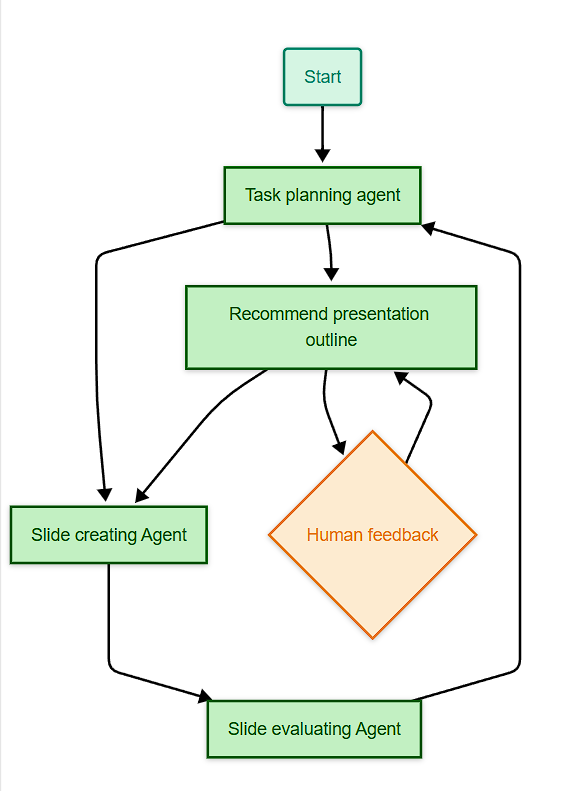

# Slide-Generator

A Langgraph-based slide generation tool.

## Prerequisites

- Python 3.10
- pip (Python package installer)

## Installation

1. Install uv (Python package installer and resolver):
```bash
pip install uv
```

2. Create and activate a virtual environment:
```bash
# Create a new virtual environment
uv venv

# Activate the virtual environment
# On Windows:
.venv\Scripts\activate
# On Unix/MacOS:
source .venv/bin/activate
```

3. Install dependencies:
```bash
uv pip install -r requirements.txt
```

## Project Structure
**In progress (Initial Recommended graph)**



