# AI Slide Generator

An automated presentation slide generator using AI with multi-agent workflow architecture, supporting multiple AI models and PDF/PPTX export.

## Overview

AI Slide Generator is a modern web application that allows users to create professional presentation slides simply by describing the topic. The application uses an intelligent multi-agent system to:

- **Automatically research** relevant information and images
- **Design layouts** and color schemes appropriate for the topic
- **Create professional** slide content
- **Edit text directly** on slides
- **Export files** in PDF and PowerPoint formats

## Key Features

### Multi-Agent System
- **Supervisor Agent**: Coordinates the workflow
- **Planner Agent**: Creates detailed plans
- **Outline Agent** (Research Agent): Researches and creates outlines
- **Artist Agent**: Designs layouts and colors
- **Slide Agent**: Creates final HTML slides

### Multiple AI Model Integration
- **Claude 3.7 Sonnet** (AWS Bedrock)
- **GPT-4o & GPT-o3** (Azure OpenAI)
- **Gemini 2.5 Pro & Flash** (Google)
- Automatic fallback mechanism between models

### Real-time Interface
- Chat interface with Socket.IO
- Streaming responses from AI
- Real-time display of slide creation process
- Approval workflow for outlines

### Professional Design
- Responsive HTML slides with Tailwind CSS
- Intelligent color palettes based on topic
- Automatic layouts for each content type
- Material Design compatibility

### Interactive Editing
- Rich text editor with complete toolbar
- Direct text editing on slides
- AI Assistant for intelligent editing
- Preview and edit modes

### Multi-format Export
- **PDF**: Playwright with precise scaling
- **PPTX**: ConvertAPI integration
- Export individual slides or combined
- Fullscreen presentation mode

## System Architecture

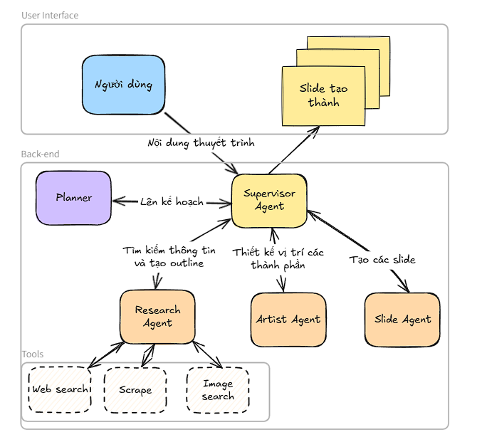

### Backend (Flask + Socket.IO)
- **app.py**: Main server with REST API and WebSocket
- **workflow.py**: LangGraph workflow with agents
- **models/LLMs.py**: AI model configurations

### Frontend (Vanilla JavaScript)
- **templates/index.html**: Main interface
- **static/style.css**: Responsive styling
- Chat panel, slides display, editors

### Utils & Tools
- **utils/tools.py**: Tools for agents (search, crawl, slide generation)
- **utils/pdf_export.py**: PDF export with Playwright
- **utils/pptx_export.py**: PPTX export with ConvertAPI
- **utils/schemas.py**: Pydantic schemas

## Installation

### System Requirements
- Python 3.11+
- Node.js (for Playwright)
- Internet connection (for AI APIs)

### 1. Clone repository
```bash
git clone https://github.com/LongNgHuynh/Slide-Generator.git
cd Slide-Generator
```

### 2. Install dependencies
```bash
# Using uv (recommended)
pip install uv
uv sync

# Or pip
pip install -r requirements.txt
```

### 3. Install Playwright browsers
```bash
playwright install chromium
```

### 4. Configure environment variables
Create a `.env` file:

```env
# Azure OpenAI (GPT-4o, GPT-o3)
AZURE_OPENAI_API_KEY=your_azure_key
AZURE_OPENAI_ENDPOINT=your_azure_endpoint

# Google AI (Gemini)
GOOGLE_API_KEY=your_google_key

# AWS Bedrock (Claude)
AWS_ACCESS_KEY_ID=your_aws_key
AWS_SECRET_ACCESS_KEY=your_aws_secret
AWS_REGION_NAME=us-east-1

# ConvertAPI (PPTX export - optional)
CONVERTAPI_API_KEY=your_convertapi_key

# Langfuse (Tracing - optional)
LANGFUSE_SECRET_KEY=your_langfuse_secret
LANGFUSE_PUBLIC_KEY=your_langfuse_public
```

### 5. Run the application
```bash
python app.py
```

Access at: http://localhost:5000

## User Guide

### 1. Create new slides
1. Enter a topic in the chat (example: "Create a presentation about AI")
2. The system will automatically:
   - Research information
   - Create an outline
   - Design the layout
   - Generate HTML slides

### 2. Edit slides
- **Edit mode**: Click the "Edit" button to enable editing mode
- **Text editing**: Click the edit icon next to text to open the rich text editor
- **AI Assistant**: Click "Ask Assistant" to edit with AI

### 3. Export files
- **PDF**: Click "Export" → "Export All Slides (Combined PDF)"
- **PPTX**: Click "Export" → "Export All Slides (Combined PPTX)"
- **Presentation**: Click "Present" to open presentation mode

### 4. Presentation mode
- Use arrow keys to navigate
- F11 or double-click for fullscreen
- ESC to exit

## Advanced Configuration

### Customize AI Models
In `models/LLMs.py`:
```python
# Change default model
LLM = Gemini()  # Or Claude_3_7_Sonnet(), GPT_4o()

# Configure fallbacks
LLM_FALLBACKS = [
    ("Claude", LLM_CLAUDE),
    ("Gemini", LLM_GEMINI),
    # ...
]
```

### Customize Design Rules
Edit `rules/html.txt` and `rules/instruction.txt` to change styles and guidelines for AI.

### Configure Export
```python
# PDF Export settings (utils/pdf_export.py)
export_slides_to_pdf(
    slide_files=files,
    method="playwright",  # or "weasyprint"
    combine=True
)

# PPTX Export (requires ConvertAPI key)
convert_pdf_to_pptx(pdf_path, output_dir, filename)
```

## API Endpoints

### REST API
- `GET /` - Main interface
- `GET /export_pdf/all` - Export PDF of all slides
- `GET /export_pdf/<slide_number>` - Export PDF of specific slide
- `GET /convert_all_slides_to_pptx` - Export PPTX of all slides
- `GET /api/slides/available` - List of available slides

### Socket.IO Events
- `send_message` - Send message from user
- `slide_generated` - Receive newly generated slide
- `text_updated` - Update slide text
- `ai_edit_slide` - Edit slide with AI

## Testing

```bash
# Test PDF export
python -m utils.pdf_export

# Test tools
python -m utils.tools
```

## Monitoring & Tracing

The application integrates **Langfuse** to monitor:
- AI model usage and performance
- Workflow execution traces
- Token usage and costs
- Error tracking

## Security

- Environment variables for API keys
- Input validation and sanitization
- Rate limiting for AI calls
- Secure file handling

## Performance

- **Parallel tool calls** to increase speed
- **Streaming responses** for better UX
- **LLM fallback** to ensure availability
- **Caching** color palettes between slides

## Contributing

1. Fork repository
2. Create feature branch: `git checkout -b feature/new-feature`
3. Commit changes: `git commit -m 'Add new feature'`
4. Push to branch: `git push origin feature/new-feature`
5. Create Pull Request

## License

MIT License - see [LICENSE](LICENSE) file for more details.

## Support

If you encounter issues:
1. Check logs in the console
2. View the `workflow.log` file
3. Create an issue with detailed information
4. Verify API keys and internet connection

## Examples

Here are some examples of slide decks generated with AI Slide Generator:

### Example 1: LLM Presentation with Sidebar Layout

**Prompt:** "Create a presentation about LLM with sidebar layout"

<div style="display: flex; flex-wrap: wrap; gap: 10px; justify-content: center;">
  <div style="flex: 0 1 45%;">
    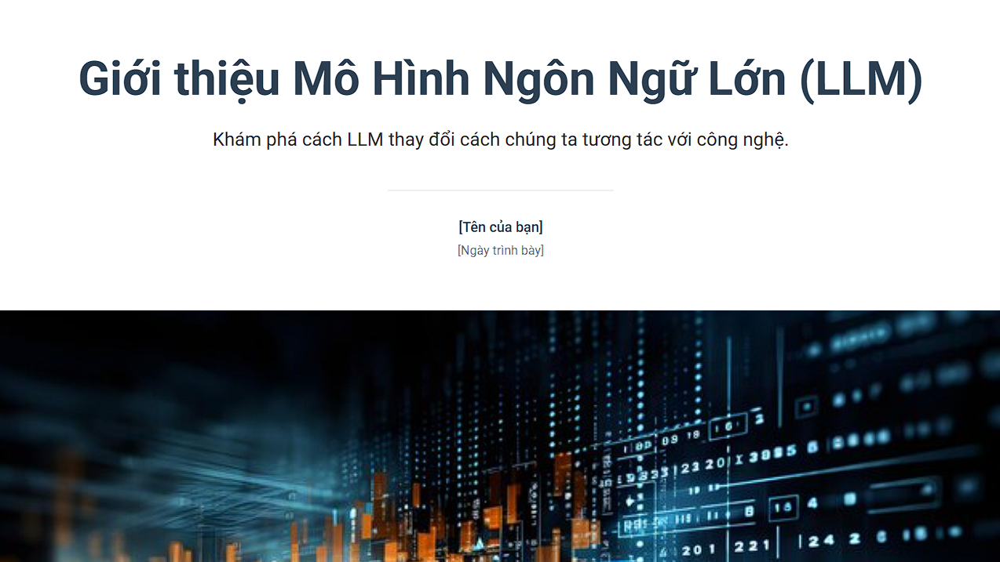
  </div>
  <div style="flex: 0 1 45%;">
    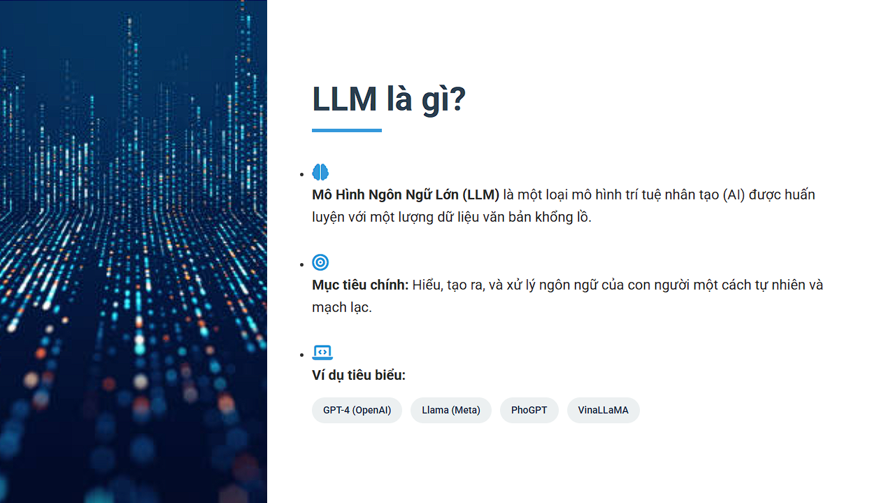
  </div>
  <div style="flex: 0 1 45%;">
    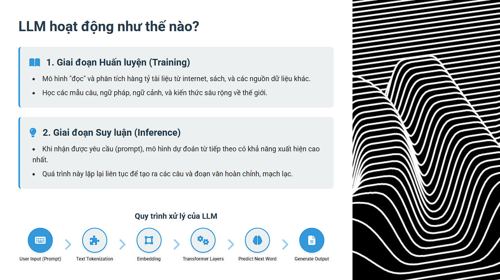
  </div>
  <div style="flex: 0 1 45%;">
    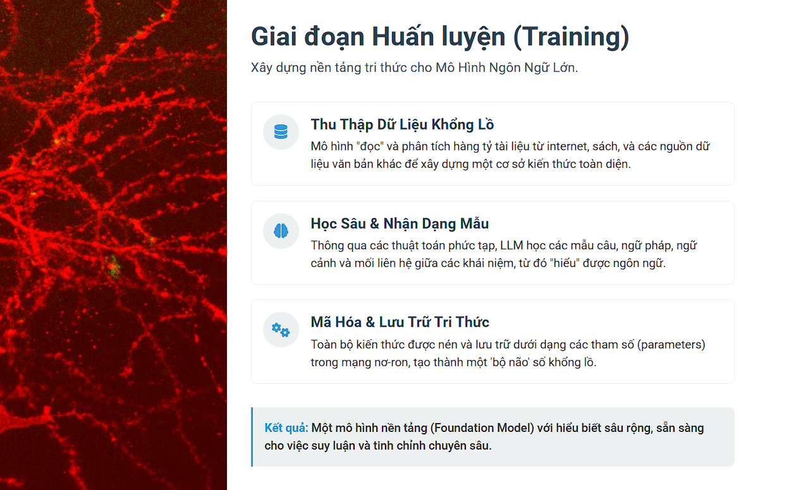
  </div>
  <div style="flex: 0 1 45%;">
    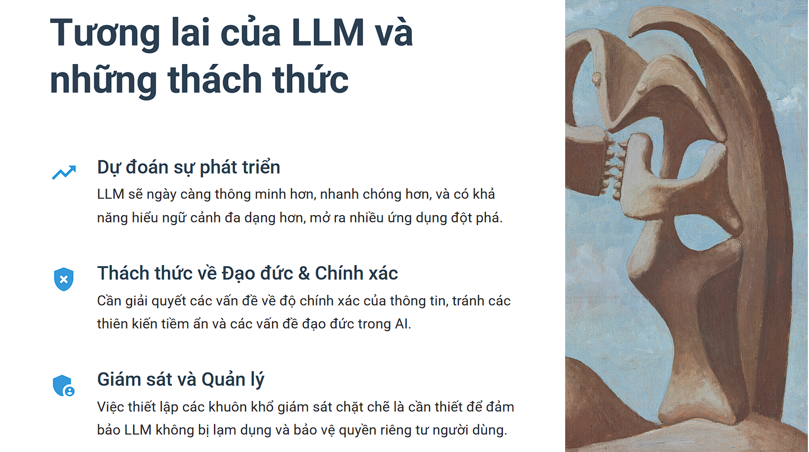
  </div>
  <div style="flex: 0 1 45%;">
    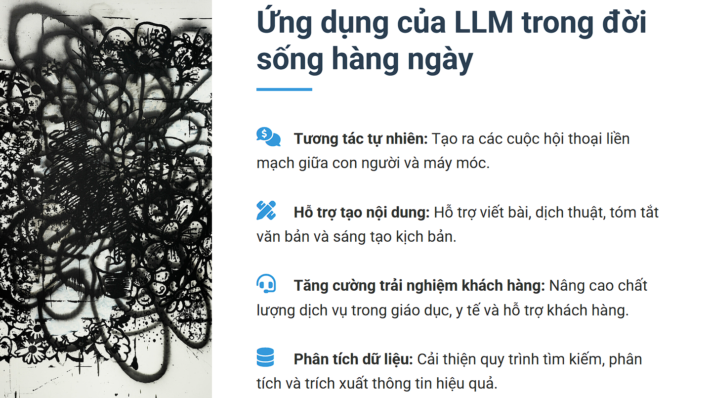
  </div>
  <div style="flex: 0 1 45%;">
    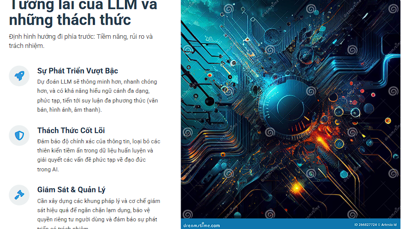
  </div>
</div>

### Example 2: LLM Trends 2025 with Dark Green Background

**Prompt:** "Create a 5-slide presentation about LLM trends for 2025 with dark green background"

<div style="display: flex; flex-wrap: wrap; gap: 10px; justify-content: center;">
  <div style="flex: 0 1 45%;">
    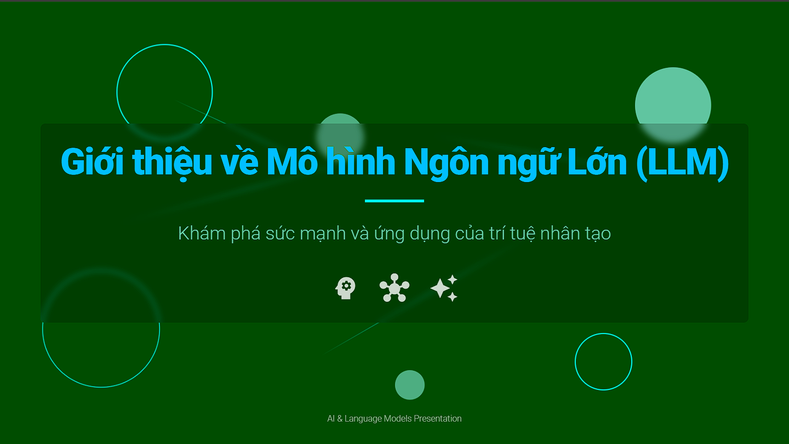
  </div>
  <div style="flex: 0 1 45%;">
    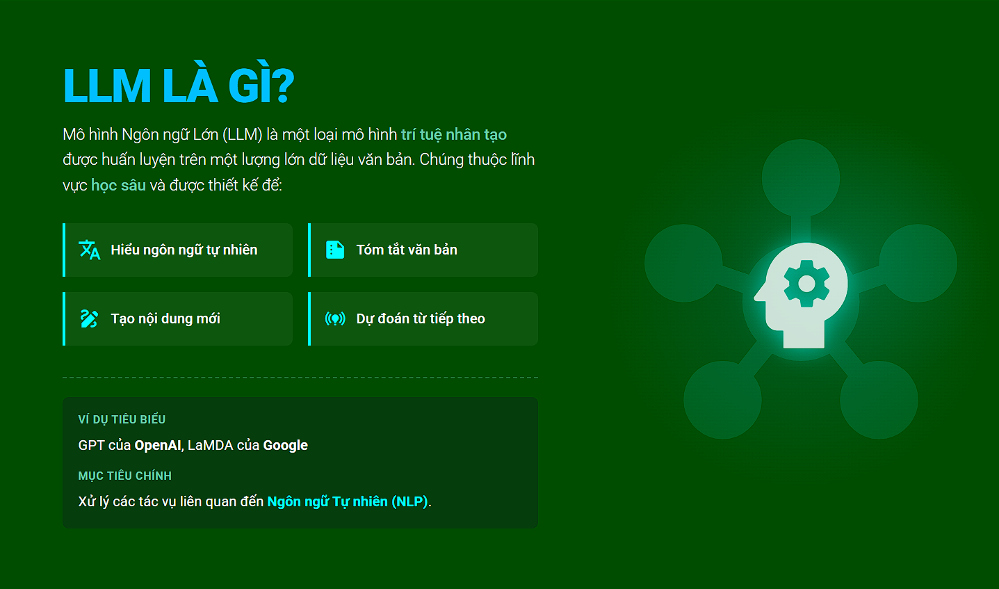
  </div>
  <div style="flex: 0 1 45%;">
    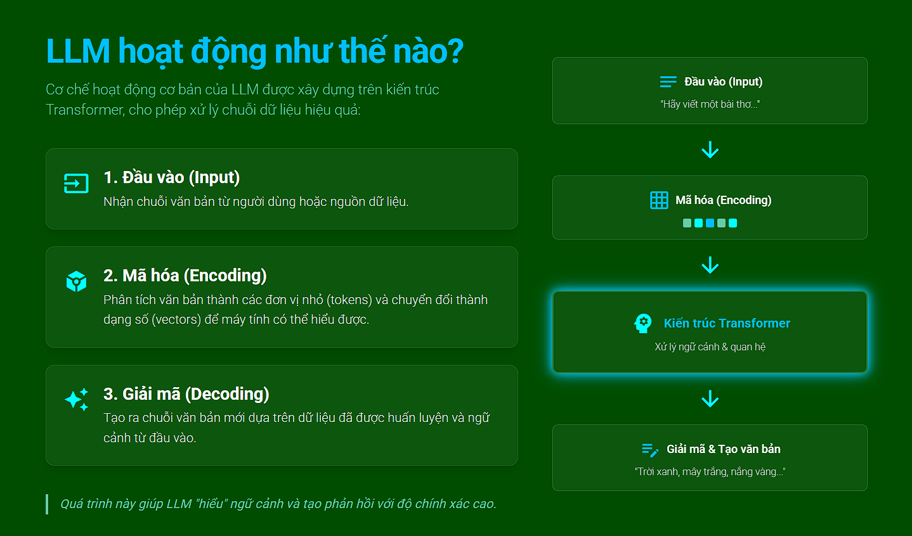
  </div>
  <div style="flex: 0 1 45%;">
    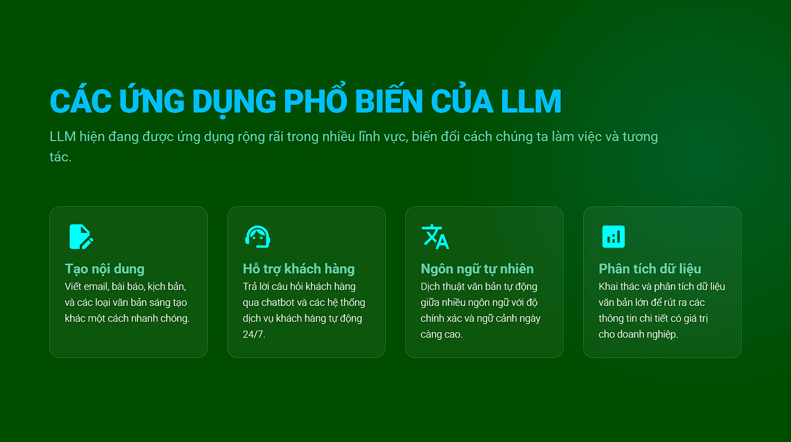
  </div>
  <div style="flex: 0 1 45%;">
    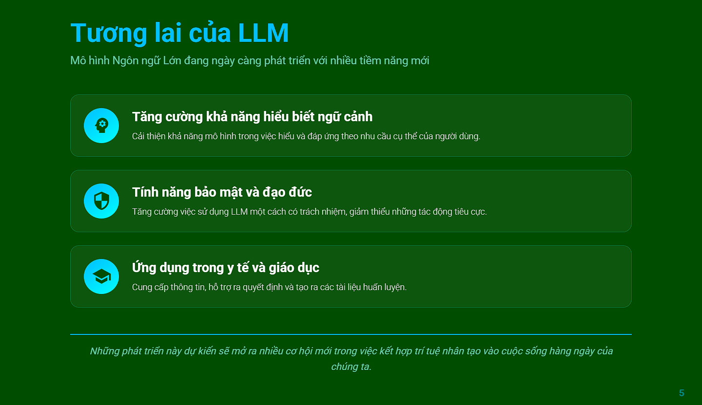
  </div>
</div>

## Roadmap

- [ ] Support for additional AI models
- [ ] Template library
- [ ] Collaboration features
- [ ] Mobile responsive
- [ ] Video export
- [ ] Voice narration

