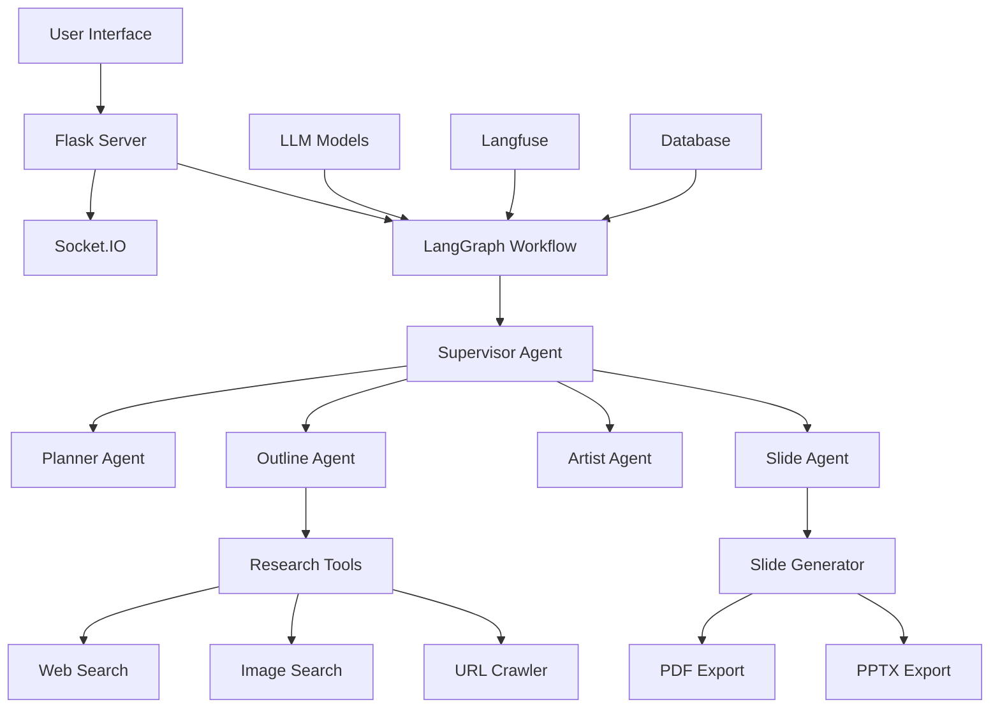

# 🏗️ Kiến trúc hệ thống AI Slide Generator

## 📖 Tổng quan kiến trúc

AI Slide Generator được xây dựng dựa trên kiến trúc **multi-agent workflow** với các thành phần chính:



## 🔧 Thành phần chính

### 1. Frontend Layer

#### **Web Interface** (`templates/index.html`)
- **Framework**: Vanilla JavaScript với modern ES6+
- **UI Components**:
  - Chat panel với Socket.IO real-time
  - Slides display với iframe scaling
  - Rich text editor với toolbar
  - Export controls và presentation mode
- **Features**:
  - Responsive design
  - Real-time slide updates
  - Interactive text editing
  - Fullscreen presentation mode

#### **Styling** (`static/style.css`)
- CSS3 với flexbox/grid layout
- Smooth animations và transitions
- Mobile-responsive design
- Dark/light theme support

### 2. Backend Layer

#### **Flask Application** (`app.py`)
- **Role**: Main web server và API gateway
- **Components**:
  - HTTP routes cho static content
  - REST API endpoints
  - Socket.IO WebSocket server
  - Session management
- **Key Features**:
  - Real-time communication
  - File upload/download
  - Export endpoints
  - Error handling

#### **Workflow Engine** (`workflow.py`)
- **Framework**: LangGraph cho workflow orchestration
- **Architecture**: State machine với conditional routing
- **Components**:
  - AgentState management
  - Node definitions
  - Edge conditions
  - Memory management

### 3. AI Agent Layer

#### **Supervisor Agent**
```python
def supervisor_node(state: AgentState) -> Command:
    """
    Intelligent workflow coordinator using LLM reasoning
    """
    # LLM-based decision making
    # Route to appropriate agent
    # Handle user approvals
    # Error recovery
```

**Responsibilities**:
- Workflow routing logic
- User interaction handling
- Approval/rejection processing
- Error recovery

#### **Planner Agent**
```python
def planner_node(state: AgentState) -> Command:
    """
    Create detailed execution plan
    """
    # Analyze user request
    # Generate task breakdown
    # Determine agent sequence
```

**Responsibilities**:
- Task decomposition
- Resource planning
- Timeline estimation

#### **Outline Agent**
```python
def outline_agent_node(state: AgentState) -> Command:
    """
    Research and create presentation outline
    """
    # Web search for information
    # Image discovery
    # Content structuring
    # Outline generation
```

**Responsibilities**:
- Content research
- Information gathering
- Outline structuring
- Image sourcing

#### **Artist Agent**
```python
def artist_agent_node(state: AgentState) -> Command:
    """
    Design layout and visual hierarchy
    """
    # Color palette selection
    # Layout design
    # Typography choices
    # Visual consistency
```

**Responsibilities**:
- Visual design
- Color scheme selection
- Layout planning
- Brand consistency

#### **Slide Agent**
```python
def slide_agent_node(state: AgentState) -> Command:
    """
    Generate final HTML slides
    """
    # HTML generation
    # Responsive design
    # Content integration
    # File output
```

**Responsibilities**:
- HTML slide generation
- Content integration
- Template application
- File management

### 4. AI Models Layer

#### **Multi-LLM Integration** (`models/LLMs.py`)

```python
class LLMManager:
    """
    Manages multiple AI models with fallback
    """
    def __init__(self):
        self.models = {
            'claude': Claude_3_7_Sonnet(),
            'gpt4o': GPT_4o(),
            'gpt_o3': GPT_o3(),
            'gemini': Gemini(),
            'gemini_flash': Gemini_2_5_Flash()
        }
        
    def invoke_with_fallback(self, prompt, preferred_model='claude'):
        # Try preferred model first
        # Fallback to alternatives on failure
        # Track usage and performance
```

**Supported Models**:
- **Claude 3.7 Sonnet** (AWS Bedrock): Primary model
- **GPT-4o/o3** (Azure OpenAI): Structured output
- **Gemini 2.5 Pro/Flash** (Google): Fast processing
- **Automatic Fallback**: Seamless model switching

### 5. Tools & Utilities Layer

#### **Research Tools** (`utils/tools.py`)

```python
@tool
def web_search(query: str) -> dict:
    """Search web for relevant information"""
    
@tool  
def image_search(query: str) -> dict:
    """Find and download relevant images"""
    
@tool
def crawl_url(url: str) -> dict:
    """Extract content from specific URLs"""
```

#### **Export Engine**

**PDF Export** (`utils/pdf_export.py`):
```python
def export_slides_to_pdf(
    slide_files: List[str],
    output_path: str,
    method: str = "playwright"
) -> dict:
    """
    Multi-method PDF export with fallback
    """
    # Playwright browser automation
    # Precise slide dimensions
    # PDF combination
    # Error handling
```

**PPTX Export** (`utils/pptx_export.py`):
```python
def convert_pdf_to_pptx(
    pdf_path: str,
    output_dir: str,
    filename: str
) -> Tuple[bool, str, str]:
    """
    PDF to PPTX conversion via ConvertAPI
    """
    # ConvertAPI integration
    # File management
    # Format validation
```

### 6. Data Layer

#### **State Management**
```python
class AgentState(TypedDict):
    messages: List[BaseMessage]
    is_outline_generated: bool
    is_outline_approved: bool
    structured_outline: Optional[dict]
    images: List[dict]
    found_information: List[dict]
    slides: List[dict]
    # ... other state fields
```

#### **File Storage**
- `generated_slides/`: Generated HTML slides
- `exports/`: Exported PDF/PPTX files  
- `temp/`: Temporary processing files
- `images/`: Downloaded image assets

### 7. Monitoring Layer

#### **Langfuse Integration**
```python
def create_workflow_trace(session_id: str, query: str):
    """
    Create comprehensive workflow tracking
    """
    trace = langfuse.trace(
        name="slide_generation_workflow",
        session_id=session_id,
        input={"user_query": query}
    )
    return trace
```

**Tracked Metrics**:
- Token usage per model
- Execution time per agent
- Error rates and types
- User satisfaction metrics

## 🔄 Workflow Execution

### 1. Request Flow
```
User Input → Supervisor → Planner → Outline → Artist → Slide → Output
```

### 2. State Transitions
```python
# State machine example
if not state.is_outline_generated:
    return Command(goto="outline_agent")
elif not state.is_outline_approved:
    return Command(goto="FINISH")  # Wait for approval
elif not state.layout_instructions:
    return Command(goto="artist_agent")
else:
    return Command(goto="slide_agent")
```

### 3. Error Handling
- **Graceful Fallback**: Multiple LLM models
- **Retry Logic**: Automatic retry với exponential backoff
- **User Feedback**: Clear error messages
- **Recovery**: Partial success handling

## 🚀 Performance Optimizations

### 1. Parallel Processing
```python
# Parallel tool execution
async def parallel_research():
    tasks = [
        web_search(query),
        image_search(query),
        crawl_url(url)
    ]
    results = await asyncio.gather(*tasks)
```

### 2. Caching Strategy
- **Color Palettes**: Persist across slides
- **Research Results**: Cache for session
- **Template Components**: Reusable layouts

### 3. Streaming Responses
```javascript
// Real-time UI updates
socket.on('agent_stream_token', (data) => {
    updateStreamingContent(data.agent, data.token);
});
```

## 🔒 Security Architecture

### 1. API Key Management
```python
# Environment-based configuration
API_KEYS = {
    'openai': os.getenv('OPENAI_API_KEY'),
    'anthropic': os.getenv('ANTHROPIC_API_KEY'),
    'google': os.getenv('GOOGLE_API_KEY')
}
```

### 2. Input Validation
- HTML sanitization
- File type validation  
- Size limits
- XSS prevention

### 3. Rate Limiting
- API call throttling
- User session limits
- Resource usage monitoring

## 📊 Data Flow

### 1. Input Processing
```
User Message → Parsing → Validation → State Update
```

### 2. AI Processing  
```
Prompt Generation → Model Selection → API Call → Response Processing
```

### 3. Output Generation
```
Content Creation → Template Application → File Generation → Export
```

## 🔧 Configuration Management

### 1. Environment Variables
```env
# AI Model Configuration
AZURE_OPENAI_API_KEY=
GOOGLE_API_KEY=
AWS_ACCESS_KEY_ID=

# Feature Flags
ENABLE_PPTX_EXPORT=true
ENABLE_LANGFUSE=true

# Performance Settings
MAX_SLIDES_PER_PRESENTATION=20
EXPORT_TIMEOUT=300
```

### 2. Runtime Configuration
```python
# Dynamic model selection
PREFERRED_MODEL = os.getenv('PREFERRED_MODEL', 'claude')
FALLBACK_ENABLED = os.getenv('ENABLE_FALLBACK', 'true').lower() == 'true'
```

## 🔮 Extensibility Points

### 1. New AI Models
```python
class NewAIModel(BaseModel):
    def invoke(self, prompt: str) -> str:
        # Implementation
        pass
```

### 2. Custom Tools
```python
@tool
def custom_research_tool(query: str) -> dict:
    """Add new research capabilities"""
    pass
```

### 3. Export Formats
```python
def export_to_new_format(slides: List[str]) -> str:
    """Add support for new export formats"""
    pass
```
